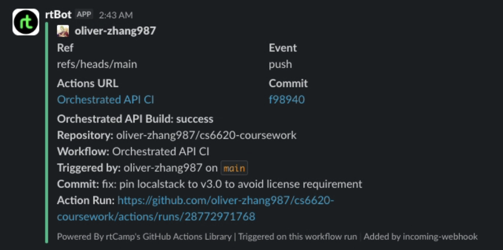

# Orchestrated API (Docker Compose + LocalStack)

REST API with full CRUD backed by DynamoDB and S3, orchestrated with Docker Compose. Uses LocalStack to run a mock of AWS locally so no real AWS account is needed.

## Architecture

```
┌─────────────┐      ┌──────────────────────────┐
│  Flask API  │─────▶│  LocalStack              │
│  (port 5000)│      │  ├── DynamoDB (items)     │
└─────────────┘      │  └── S3 (items-bucket)    │
                     └──────────────────────────┘
```

Docker Compose starts both containers and wires them together. An init script (`init_aws.sh`) creates the DynamoDB table and S3 bucket when LocalStack is ready.

## API Endpoints

| Verb   | Endpoint       | Description                                      | Status Codes                |
|--------|---------------|--------------------------------------------------|-----------------------------|
| GET    | `/items`       | Get all items                                    | `200 OK`                    |
| GET    | `/items/<id>`  | Get a specific item by ID                        | `200 OK` / `404 Not Found`  |
| POST   | `/items`       | Create a new item (JSON: `{"name": "..."}`)      | `201 Created` / `400` / `409 Conflict` |
| PUT    | `/items/<id>`  | Update an existing item (JSON body)              | `200 OK` / `404` / `400`    |
| DELETE | `/items/<id>`  | Delete an item                                   | `200 OK` / `404 Not Found`  |

- POST and PUT accept a JSON body.
- POST returns `409` if an item with the same name already exists.
- Each item is stored as a row in DynamoDB **and** a JSON object in S3 (keyed by item id).

## Running the Stack

### Prerequisites
- Docker and Docker Compose installed

### 1. Start the full stack (runs until stopped)
```bash
./run_stack.sh
```
This builds the containers, starts LocalStack + the API, and maps the API to `http://localhost:5000`. Press `Ctrl+C` to stop everything.

Example usage:
```bash
# create an item
curl -X POST http://localhost:5000/items \
  -H "Content-Type: application/json" \
  -d '{"name": "Widget", "description": "A cool widget"}'

# list all items
curl http://localhost:5000/items
```

### 2. Run the tests
```bash
./run_tests.sh
```
Spins up the full stack (LocalStack + API + test runner), runs `pytest` against the live API, then tears everything down. Exits with status `0` if all tests pass, non-zero if any test fails.

## Local Development (Without Docker)

You'll need a running LocalStack instance (e.g. `localstack start`).

```bash
pip install -r requirements.txt

export AWS_ENDPOINT_URL=http://localhost:4566
export AWS_DEFAULT_REGION=us-east-1
export AWS_ACCESS_KEY_ID=test
export AWS_SECRET_ACCESS_KEY=test

python src/app.py
```

## Tests

Tests are integration tests that exercise the full stack end-to-end. They send HTTP requests to the API and also verify DynamoDB and S3 state directly using `boto3`.

Covered cases:
- GET with a valid id returns expected JSON (DB + S3 match)
- GET with a nonexistent id returns 404
- GET with no id (`/items`) returns all items
- GET with an invalid id returns 404
- POST creates item in both DynamoDB and S3
- Duplicate POST returns 409
- PUT updates both DynamoDB and S3
- PUT on nonexistent item returns 404
- DELETE removes item from both DynamoDB and S3
- DELETE on nonexistent item returns 404

## CI/CD Pipeline

GitHub Actions workflow at `.github/workflows/orchestrated-api.yml`.

### Triggers
- Automatic: any push or pull request that changes files in `orchestrated-api/`.
- Manual: can be triggered from the Actions tab (`workflow_dispatch`).

### Slack Notifications
Test results are sent to a Slack channel. To configure:
1. Set up an Incoming Webhook in your Slack workspace.
2. Add a repository secret named `SLACK_WEBHOOK_URL` with the webhook URL.

Here is an example of a successful build notification:


